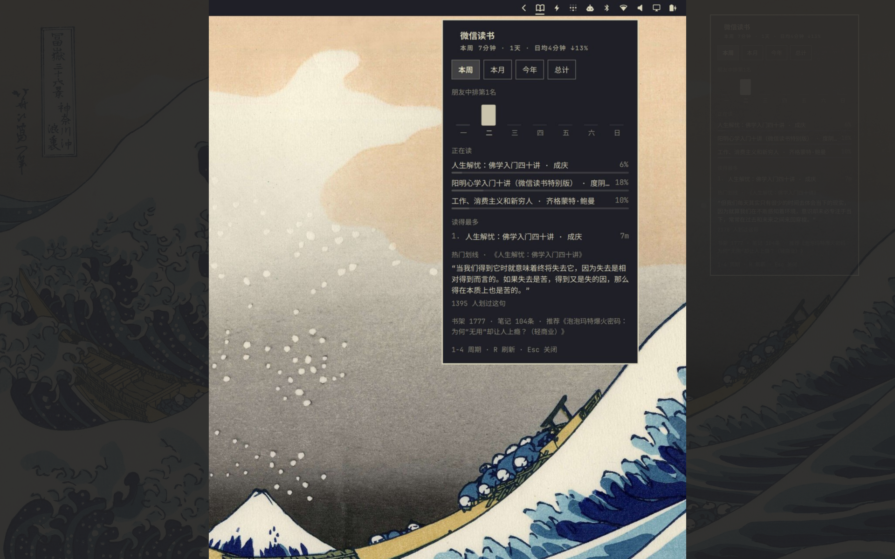

# WeRead for Omarchy

微信读书 reading stats as a native [Omarchy](https://omarchy.org) shell plugin (Omarchy 4 "Quattro" or later), powered by the official [WeRead agent API](https://github.com/Tencent/WeChatReading).

<p align="center">
  
</p>

- **Bar widget** — an open-book glyph in the bar. A dot on the spine appears once you've read today; the tooltip carries 今天 / 本周 time and your consecutive-days streak.
- **Four period views** — 本周 / 本月 / 今年 / 总计 (keys `1`–`4`), each with a bar chart at matching granularity: days, days, months, years. Week-over-week trend, friend ranking, and preference words (偏好夜间阅读 …) ride along when the API offers them.
- **正在读** — progress bars for the three most recently read books on your shelf.
- **读得最多** — the books the period's time actually went to.
- **热门划线** — a popular highlight from your top book, re-rolled every time the panel opens, with its 划线人数.
- **Lifetime footprint** — 读过 / 读完 / 阅读天数 / 笔记 counts, shelf size, and a 为你推荐 pick in the footer.
- **Disk cache** — the last good bundle lives in `~/.local/state/omarchy/weread/bundle.json`, so the bar never starts blank.

## Setup

The plugin talks to the WeRead API gateway (`i.weread.qq.com/api/agent/gateway`) and needs an API key bound to your account:

1. Get your key at [weread.qq.com/r/weread-skills](https://weread.qq.com/r/weread-skills) (format `wrk-…`)
2. Provide it either way — **the key file is the reliable one**, because the shell is a long-running graphical process that never sources your `.bashrc`:

```bash
# a) key file (recommended)
mkdir -p ~/.config/omarchy/weread
echo -n wrk-xxxxxxxx > ~/.config/omarchy/weread/api-key
chmod 600 ~/.config/omarchy/weread/api-key

# b) environment variable (only if the shell process itself sees it)
export WEREAD_API_KEY=wrk-xxxxxxxx
```

## Install

```bash
omarchy plugin add https://github.com/ya-luotao/omarchy-weread.git --enable
```

## Usage

- Left-click the book → panel
- `1`–`4` switch period (本周/本月/今年/总计) — your choice persists
- Middle-click (or `R` in the panel) → refresh now
- `Esc` closes the panel

From scripts:

```bash
omarchy-shell luotao.weread status    # {"ok":true,"streakDays":5,"shelfCount":1777,...}
omarchy-shell luotao.weread refresh
```

### Settings

```bash
omarchy bar set luotao.weread refreshMinutes 30        # poll less often (default 15)
omarchy bar set luotao.weread defaultPeriod monthly    # land on 本月 when the panel opens
```

## How it works

`tools/weread-sync` fires the independent gateway calls in parallel (4× `/readdata/detail`, `/shelf/sync`, `/user/notebooks`, `/book/recommend`), then the dependent ones (`/book/getprogress` for your three most recent books, `/book/bestbookmarks` for the week's top book), and assembles one trimmed JSON bundle with `jq`. The QML widget renders that bundle; the consecutive-days streak is computed locally from this + last month's daily buckets (≥1 min/day, the server's 有效阅读 rule). All durations from the API are **seconds**.

`tools/weread-api` is the low-level single-call wrapper the sync script grew out of — handy for debugging:

```bash
tools/weread-api /readdata/detail '{"mode":"monthly"}' | jq .
```

## Development

Symlink the repo into the plugin dir and the shell picks it up:

```bash
ln -sfn "$PWD" ~/.config/omarchy/plugins/luotao.weread
omarchy-shell shell rescanPlugins
```

Note: the shell's hot-reload watcher does not follow symlinks — after editing, run `omarchy restart shell` to pick up changes.

## License

[MIT](./LICENSE)
